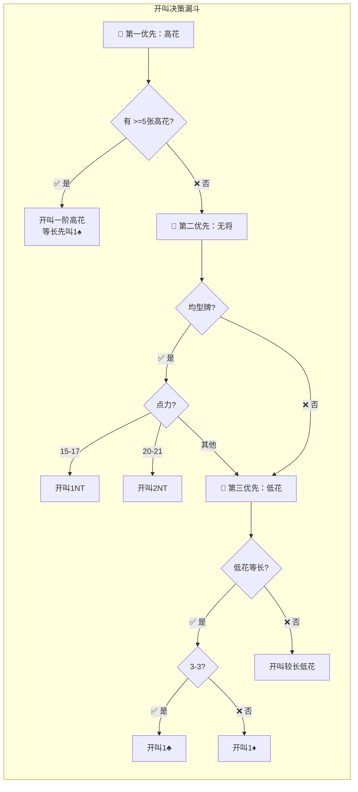

# 2/1 GF

> 二盖一逼局体系 [WIP]
> 本文档记录的是我本人（也就是Oozora）对于2/1 GF的理解、总结，不保证正确性，有问题可以友好沟通和交流。

## 牌型

在开始之前，先要理解牌型，

1. 均型：4333、4432、5332
  - 没有空门
  - 没有单张
  - 最多只有一门双张
  - https://blueberrybridge.com/bridgedefinitions/balanced-hand/
2. 半均型：5422、6322、7222（这种非常少见，少见是指概率非常低 ～0.513%，也就是平均大约需要打 195 手牌才可能拿到一次）
  - https://static1.squarespace.com/static/5127d3d2e4b0b304f0b6db24/t/58dd110d1b10e38a0a19976c/1490882831004/1+Hand+Type+-+Balanced+Hand+and+Unbalanced+Hands.pdf
  - https://en.wikipedia.org/wiki/Balanced_hand
3. 非均型：
  - 4441
  - 5431、5440、5530
  - 6511、6520、6610
  - 7600
  - ...

## 花色等级

有四个花色：黑桃（Spade）、红桃（Heart）、方块（Diamond）、草花（Cube），等级依次降低。其中黑桃和红桃称为高级花色、方块和草花称为低级花色。

## 成局基本点力和倾向

我们有三种成局定约：高花成局（4S/4H）、无将成局（3NT）、低花成局（5D/5C）。一般来说高花/无将我们基本要求联手点力>=25点，低花要到5阶要求更高（要>=28点）。
同时，我们还有两种满贯定约：
- 小满贯（6NT/6S/6H/6D/6C）：基本联手点力要求33点（不能缺2个A）
- 大满贯（6NT/6S/6H/6D/6C）：基本联手点力要求37点（不能缺1个A）

我们能看到，阶数越高、点力要求越高，而且5阶低花成局离满贯仅一步之遥。所以我们一般优先考虑高花成局、其次无将、最后低花。叫牌策略也是按照这个方向走。

有些人可能会有疑问了，3NT只到3阶，为啥不是优先无将呢。有一些牌套量的同学会有这样的感觉——无将很难打。是的，无将大多靠的是硬实力和点力配合。25点、甚至27点打不成也都正常，有疑问的话后面多打打就有感受了，可以先留个印象。

## 叫牌 Bidding

第一步要熟练掌握无敌手叫牌：也就是没有敌方干扰的情况下是否能叫到一个合理的结果。
第二步要学习如何争叫：也就是我们怎么去在别人开叫后去争抢定约，以合理的方式去参与竞争叫牌、达到一个争抢定约以及干扰叫牌的目标，其中也包括直接位置和平衡位置的处理逻辑。
第三步要知晓如何处理干扰叫牌：也就是如果我们开叫被地方干扰、或者敌方开叫我们干扰达到一个复杂局面下我们如何处理。
再之后可能是：
1. 对于特别体系的一些对抗策略：其实这个和第三步是重合的，只不过可能可以针对一些体系有特殊的对抗策略（其实现在主要也就是自然体系和精确体系）
2. 对于约定叫的学习和使用（没有足够的牌套量和基础理论做支撑，压根理解不了约定叫的、更说不上能用好约定叫）
3. 特殊牌型的处理，比如单套牌的处理等等。

### 无敌手叫牌基础

我认为无敌手叫牌是基本能力，能较好的做好无敌手叫牌才能称之为快入门了。其中无敌手叫牌我认为最重要的是这几块内容：
1. 开叫
2. 应叫
3. 开叫人再叫
4. 应叫人再叫
5. 满贯叫牌
6. 狙击叫

其中如果到了第四步，也就是已经喊了4声，对于大多数牌基本已经明确了结果或者结果走向（部分定约、成局、满贯试探），然后对于如果有满贯意愿的会走到第五步进行满贯叫牌，下面一一阐述交流。

另外，有些时候我们有单套牌，但是点力并不强，我们可能为了干扰敌方叫牌会选择狙击叫，这个也在后面阐述。

注意：这里面所有内容除了特别声明，否则不包含特定约定叫带来的变化，比如伯根加叫、傀儡stayman等。

#### 开叫

> 注意：以下不考虑第三家轻开叫，我目前的水平和知识体系，我不会去使用这个策略。

自然叫牌中开叫主要是根据点力划分为两个区间：
1. 12-21点区间
2. 22点以上区间

对于22点以上，以人工叫品2C开叫，和草花无关，逼叫。下面主要阐述12-21点区间的基本开叫原则（其实就是个决策树）。以文本描述的话就是：

1. 是否有>=5张高花
  - 是：高花是否等长
    - 是：开叫1S（等级更高）
    - 否：谁长开叫谁
  - 否：是否是均型牌
    - 是：点力是否是15-17点
      - 是：开叫1NT
      - 否：点力是否是20-21点
        - 是：开叫2NT
        - 否：进入低花开叫决策逻辑
    - 否：进入低花开叫决策逻辑
2. 低花开叫决策逻辑
  - 低花是否等长：
    - 是：是否是3-3低花
      - 是：开叫1C
      - 否：开叫1D
    - 否：谁长开叫谁

另外有个20法则可以了解一下（点力+两套牌的长度如果超过了20，也可以开叫），比如这手牌：SAQT85 HKJT98 D23 C2也可以开1S。但是要注意不能随便去开，比如只有10个点，有个单张Q或者双张QJ，那这个牌的价值很可能降低了，最好不要随便开叫。这涉及到对于手牌的价值评估。我们可以先有个印象：我们的手牌价值随着叫牌进程的推进会升值/贬值，也就是说会有28个点打不成局、20个点打成满贯的情况。

### 应叫

复习一下，同伴的开叫有4种：
1. 1阶高花：1S/1H
2. NT开叫：1NT/2NT
3. 1阶低花：1D/1C
4. 强牌开叫：2C（人工叫品）

根据不同的同伴开叫叫品，我们有不同的处理策略，在讲述不同叫品的应叫原则之前，我们先知晓一些基本原则：

1. 一盖一应叫（用一阶更高级的花色应叫）：点力一般>=6点、所应叫花色长度>=4张。比如 1C -> 1D, 1C -> 1H, 1H -> 1S。有几个注意事项：
  - 高花低花等长时优先应叫高花：比如有4张红桃、4张方块，优先应叫1H而不是1D。
  - 两高花如果等长：
    - 是4-4高花则应叫1H
    - 其他则应叫1S
  - 其他优先应叫最长的（当然同等长度选等级更高的）就好：比如5张黑桃、4张红桃、5张方块，则应叫1S。
2. 二盖一应叫（用二阶比开叫花色低的花色应叫）：
  - 点力一般>=13点
  - 长度要求：
    - 如果是用高花二盖一要求应叫高花有5张（其实只有开叫1S、应叫2H这种情况）
    - 如果是用低花二盖一要求应叫低花有4张（比如1S->2D、1H->2C）

那如果我们又能二盖一、又能一盖一，我们怎么选择呢。有这个问题的很棒，比如1D开叫，我们可以1H/1S、也可以2C。那我们先可以记住这句话：好牌慢叫。所以可以先考虑优先一盖一。

下面根据不同的开叫叫品，我们来考虑不同的应叫原则和思路。

#### 1阶高花的应叫

#### 1阶低花的应叫

#### 无将的应叫

#### 2C的应叫

### 开叫人再叫

其中，对于12-21点，我们又根据～3点划分为3档：
1. 12-15点
2. 16-18点
3. 19-21点
  - 12-21点：
    - 首先：有>=5张高花优先开叫一阶高花
    - 其次：如果是均型牌/半均型牌
      - 15-17点开叫1NT
      - 20-21点开叫2NT
    - 最后：开叫1阶低花
  - 22点以上：2C开叫

### 应叫人再叫

## 争叫

### 花色争叫

### 加倍

#### 加倍后的再加倍

## 强自由、弱自由
